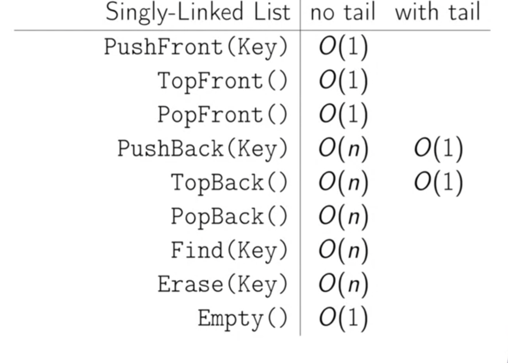

# Arrays

## Summary
So linked lists, it's named kind of like links in a chain.
The main difference between array and linked list is its dynamic means it can grow dynamically
we don't need to specify the size and not contiguous block of memory

## Operations Costs
- Front means pushing in the beginning and Back means pushing at the end

